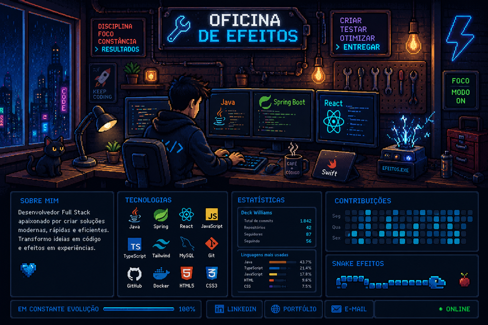

# 👋 Olá, eu sou Derick Williams

---

# 🚀 Sobre mim

💻 Desenvolvedor Full Stack

🎯 Apaixonado por criar aplicações modernas, landing pages e interfaces intuitivas.

📚 Sempre estudando novas tecnologias.

⚡ Atualmente focado em:

- Java
- Spring Boot
- React
- Tailwind CSS
- SwiftUI
- Inteligência Artificial

---

# 🛠 Tecnologias

---

# 📊 Estatísticas

---

# 🔥 Sequência de contribuições

---

# 🐍 Snake Animation

---

# 🚀 Projetos em destaque

| Projeto | Tecnologias |
|----------|-------------|
| 🌐 Landing Pages | React • Tailwind |
| ☕ APIs REST | Java • Spring Boot |
| 📱 Aplicativos iOS | SwiftUI |
| 💼 Portfólio | React |

---

# 🌎 Contato

---

### 💙 Obrigado pela visita!

"Transformando ideias em código."

